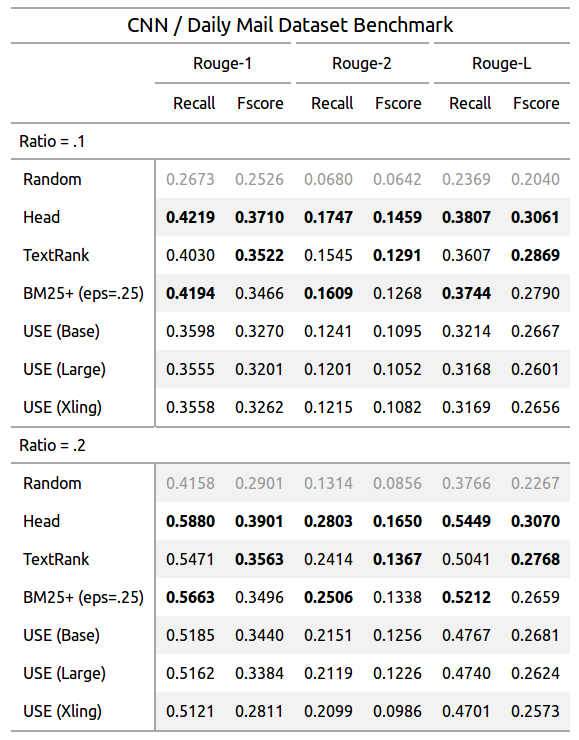

# textrank_summary_benchmark

Benchmark results for some of the TextRank variants

It turns out all variants cannot beat the simplest heuristic baseline for the CNN/DailyMail dataset...

## Instructions

### CNN / Daily Mail Dataset

Download the dataset from [harvardnlp/sent-summary](https://github.com/harvardnlp/sent-summary) and extract into `data/cnndm' subfolder inside the project folder.

To run the inference and evaluations:

Random Sampling and Head Heuristics(pick the first 10% or 20% of the sentences):

```bash
python baseline.py
```

The Original TextRank algorithm and BM25+ with IDF eps[2]:

```bash
python textrank_base.py
```

The Universal Sentence Encoder[3] from Tensorflow Hub with cosine similariy:

```bash
python textrank_use.py
```

Please refer to the Universal Sentence Encoder section for more details.

## Universal Sentence Encoder

The [base model](https://tfhub.dev/google/universal-sentence-encoder/2) currently does not supports GPU. And the other two larger models ([large](https://tfhub.dev/google/universal-sentence-encoder-large/3) and [xling](https://tfhub.dev/google/universal-sentence-encoder-xling-many/1)) are very slow on CPU. Therefore I made to seperate configuration for GPU and CPU setup. For now, you need to manually comment and uncomment the relevant lines (`MODEL=...`) in `textrank_use.py`to switch between CPU and GPU.

Two Dockerfiles are provided for easier environment setup.

## Results

[](misc/gt_results.html)

Notes:

* Head: Pick the first "Ratio*100"% of the sentences.
* Random: Randomly pick "Ratio*100"% of the sentences.
* USE: Universal Sentence Encoder

## References

1. Mihalcea, R., Tarau, P.:
  `"Textrank: Bringing order into texts" <http://www.aclweb.org/anthology/W04-3252>`__.
  In: Lin, D., Wu, D. (eds.)
  Proceedings of EMNLP 2004. pp. 404–411. Association for Computational Linguistics,
  Barcelona, Spain. July 2004.

2. Barrios, F., López, F., Argerich, L., Wachenchauzer, R.:
  `"Variations of the Similarity Function of TextRank for Automated Summarization" <https://arxiv.org/pdf/1602.03606.pdf>`__.
  Anales de las 44JAIIO.
  Jornadas Argentinas de Informática, Argentine Symposium on Artificial Intelligence, 2015.

3. Daniel Cer, Yinfei Yang, Sheng-yi Kong, Nan Hua, Nicole Limtiaco, Rhomni St. John, Noah Constant, Mario Guajardo-Céspedes, Steve Yuan, Chris Tar, Yun-Hsuan Sung, Brian Strope, Ray Kurzweil:
 [Universal Sentence
Encoder. arXiv:1803.11175, 2018.](https://arxiv.org/abs/1803.11175)
