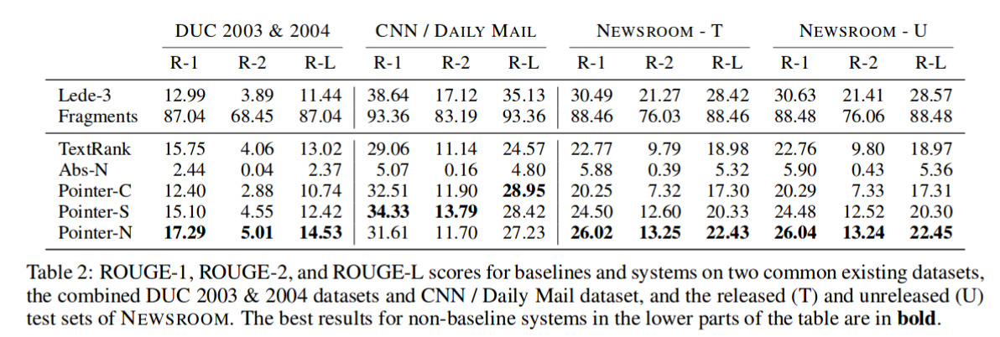
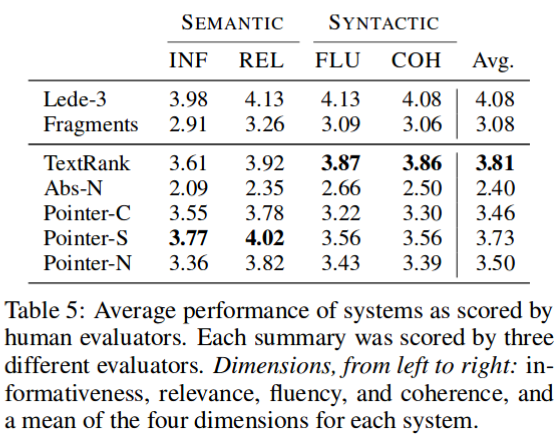

# textrank_summary_benchmark

Benchmark results for some of the TextRank variants

It turns out all variants cannot beat the simplest heuristic baseline for the CNN/DailyMail dataset...

## Instructions

### CNN / Daily Mail Dataset

Download the dataset from [harvardnlp/sent-summary](https://github.com/harvardnlp/sent-summary) and extract into `data/cnndm' subfolder inside the project folder.

To run the inference and evaluations:

Random Sampling and Head Heuristics (pick the first 10% of the sentences):

```bash
python baseline.py 0.1
```

The Original TextRank algorithm and BM25+ with IDF eps[2]:

```bash
python textrank_base.py 0.1
```

The Universal Sentence Encoder[3] from Tensorflow Hub with cosine similariy:

```bash
python textrank_use.py 0.1
```

Please refer to the Universal Sentence Encoder section for more details.

## Universal Sentence Encoder

The [base model](https://tfhub.dev/google/universal-sentence-encoder/2) currently does not supports GPU. And the other two larger models ([large](https://tfhub.dev/google/universal-sentence-encoder-large/3) and [xling](https://tfhub.dev/google/universal-sentence-encoder-xling-many/1)) are very slow on CPU. Therefore I made to seperate configuration for GPU and CPU setup.

To use the CPU setup (`base`) run:

```bash
python textrank_use.py --cpu 0.1
```

Two Dockerfiles are provided for easier environment setup.

## Results

[](misc/gt_results.html)

Notes:

* Head: Pick the first "Ratio*100"% of the sentences.
* Random: Randomly pick "Ratio*100"% of the sentences.
* USE: Universal Sentence Encoder

### Samples

Some sample results are provided in the [samples/](samples/) folder. They are collected via [collect_samples.py](collect_samples.py).

### Remarks

The sentence embeddings are supposed to better capture the semantic information than term frequency features, but the results shows using these embeddings to compute similarities between sentences yields consistently worse Rouge scores than traditional term-based metrics. The fact that Rouge requires strict adherence to the n-grams of the reference summaries probably has something to do with this result.

The extractive TextRank algorithm underperform simple heuristic baseline is in line with the results from Grusky et al.[4]:



However, TextRank fares better under human evaluations, outperforming deep learning models overall, but still fell short of the heuristic baseline:



## References

1. Mihalcea, R., Tarau, P.:
  [Textrank: Bringing order into texts](http://www.aclweb.org/anthology/W04-3252).  In: Lin, D., Wu, D. (eds.)
  Proceedings of EMNLP 2004. pp. 404–411. Association for Computational Linguistics,
  Barcelona, Spain. July 2004.

2. Barrios, F., López, F., Argerich, L., Wachenchauzer, R.:
  [Variations of the Similarity Function of TextRank for Automated Summarization](https://arxiv.org/pdf/1602.03606.pdf).  Anales de las 44JAIIO.  Jornadas Argentinas de Informática, Argentine Symposium on Artificial Intelligence, 2015.

3. Daniel Cer, Yinfei Yang, Sheng-yi Kong, Nan Hua, Nicole Limtiaco, Rhomni St. John, Noah Constant, Mario Guajardo-Céspedes, Steve Yuan, Chris Tar, Yun-Hsuan Sung, Brian Strope, Ray Kurzweil:
 [Universal Sentence
Encoder. arXiv:1803.11175, 2018.](https://arxiv.org/abs/1803.11175)

4. Grusky, M., Naaman, M., & Artzi, Y. (2018). [Newsroom: A Dataset of 1.3 Million Summaries with Diverse Extractive Strategies.](https://doi.org/10.18653/v1/N18-1065)